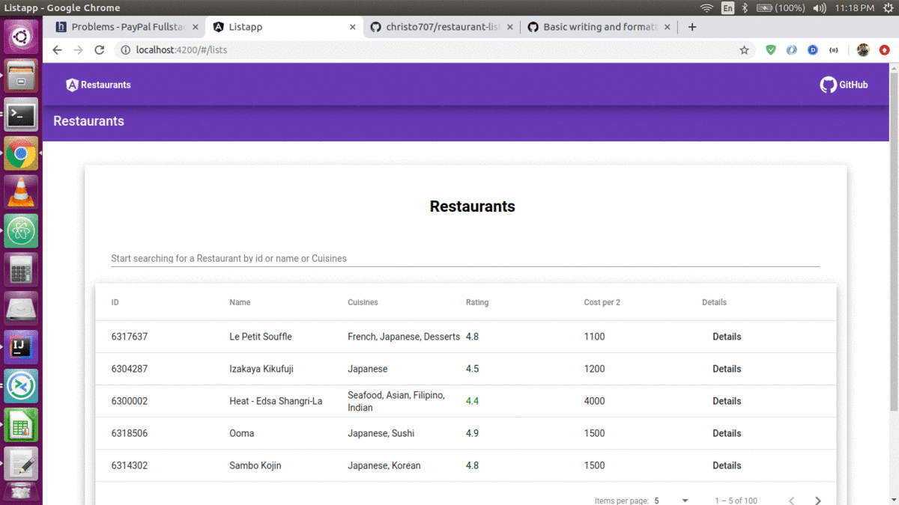

=======
# restaurant-list
Pseudo angular app to display restaurants

Steps to run:

1. Install nodejs and npm
2. Run ```npm i ```
3. To serve angular run ```ng serve```

#Live Version:

[Live Hosted app](http://restaurants-list.s3-website.ap-south-1.amazonaws.com "Restaurant List App") 

Screenshots:


